%%# 北京电子科技学院（BESTI）

%%# 实  验  报  告

课程：密码系统设计　　　班级：2413

姓名：蔡贸俊　　　　　　学号：20241328

成绩：　　　　　　　　　指导教师：赵越

实验日期：2026/10/8

实验密级：无

预习程度：已预习

实验时间：2026/10/8　　仪器组次：无　　必修/选修：必修

实验序号：实验一

实验名称：嵌入式开发基础

实验目的与要求：掌握 Linux 系统使用与 C 语言开发方法；掌握 OpenSSL（GmSSL）的基本用法与开发；掌握 SM2、SM3、SM4 商用密码算法的使用；两人一组使用命令与编程两种方式实现带签名的数字信封协议。

实验仪器：计算机 1 台（Windows 11 + WSL2 虚拟机 openEuler 24.03 LTS）

[[PAGEBREAK]]

# 1. 实验内容

1. 在 openEuler 中实践 OpenSSL 命令（版本、随机数、SM4 加解密、SM3 摘要与 HMAC、SM2 签名验签、性能测试），用 Markdown 记录并逐项 git commit。
2. 在 openEuler 中实践 GmSSL 命令（SM4、SM3/HMAC、SM2 密钥生成/签名验签/加解密），并与 OpenSSL 结果交叉验证。
3. 两人一组，用 OpenSSL 命令实现带签名的数字信封协议（Alice 蔡贸俊 发送，Bob 元泓鉴 接收）。
4. 两人一组，用 GmSSL 命令实现带签名的数字信封协议（Bob 发送，Alice 接收）。
5. 用 OpenSSL 库编程调用 SM2（加密解密、签名验签）、SM3（摘要、HMAC）、SM4（加解密）。
6. 用 GmSSL 库编程完成同样调用。
7. 两人一组，用 OpenSSL 库、GmSSL 库编程实现带签名的数字信封协议，并公开发送/接收程序。
8. 将代码与文档托管至 gitee，提交过程 Markdown 与 PDF、git log，并记录问题与反思。

# 2. 实验步骤

## 2.1 步骤1：搭建实验环境（WSL2 + openEuler + OpenSSL/GmSSL）

### 2.1.1 操作内容

在 Windows 上启用 WSL2 并安装 openEuler 24.03 LTS；用 dnf 安装编译工具链与 OpenSSL 开发头文件（gcc-c++、cmake、openssl-devel，系统自带 OpenSSL 3.0.12）；源码编译安装 GmSSL 3.3.0（git clone → cmake -B build → cmake --build build -j → cmake --install build）；因 libgmssl 安装到 /usr/local/lib 后不在 ldconfig 缓存，写入 /etc/ld.so.conf.d/gmssl.conf 并执行 ldconfig，使链接与运行时可找到库。

### 2.1.2 操作结果

```text
$ gcc --version | head -1
gcc (GCC) 12.3.1 (openEuler 12.3.1-38.oe2403)
$ cmake --version | head -1
cmake version 3.27.9
$ openssl version
OpenSSL 3.0.12 24 Oct 2023 (Library: OpenSSL 3.0.12 24 Oct 2023)
$ gmssl version
GmSSL 3.3.0-dev.1183
$ cat /etc/ld.so.conf.d/gmssl.conf
/usr/local/lib
```

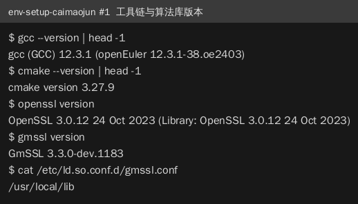

## 2.2 步骤2：OpenSSL 命令实践（SM4/SM3/HMAC/SM2/speed）

### 2.2.1 操作内容

依次实践：`openssl version`、`openssl rand -hex 16` 生成 16 字节密钥；`openssl enc -sm4-cbc` 对明文（姓名学号）加解密并比对；`openssl dgst -sm3` 计算摘要、`-hmac` 计算 HMAC，并改变明文 1 字节验证雪崩效应；`openssl ecparam -genkey -name SM2` 生成密钥、`openssl dgst -sm3 -sign/-verify` 签名验签；`openssl speed` 测性能。

### 2.2.2 操作结果

```text
$ openssl enc -sm4-cbc -e -in plain.txt -out plain.sm4 -K $(cat sm4.key) -iv 000...0
$ openssl enc -sm4-cbc -d -in plain.sm4 -out plain.dec -K $(cat sm4.key) -iv 000...0
$ cmp plain.txt plain.dec && echo SM4-CBC-ROUNDTRIP-OK
SM4-CBC-ROUNDTRIP-OK
$ openssl dgst -sm3 plain.txt
SM3(plain.txt)= 4543fcd70da081d21d1310e973e4adcb94dce80b3cc6b21051c630740c913cc2
$ openssl dgst -sm3 -hmac mykey123 plain.txt
HMAC-SM3(plain.txt)= 6dfb23c9f1d0f62fe7008353a13b4326c7187f39e84ae542d8204a8a487abbc9
$ openssl dgst -sm3 -verify sm2_pub.pem -signature sig.bin plain.txt
Verified OK
```

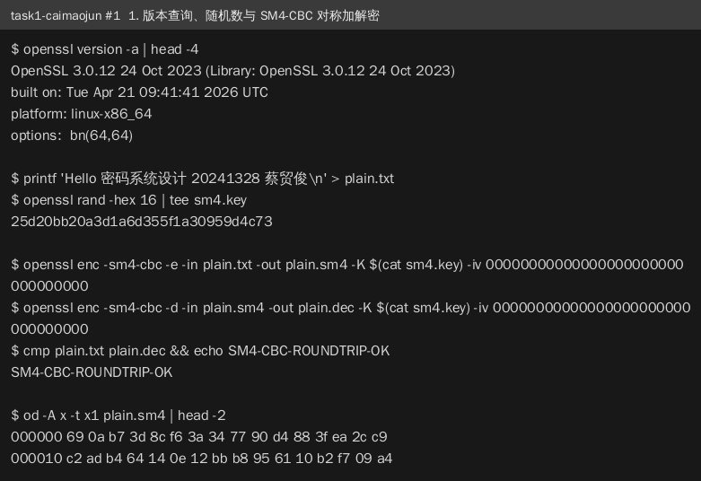

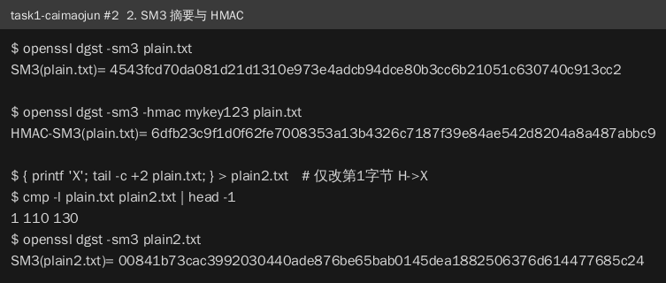

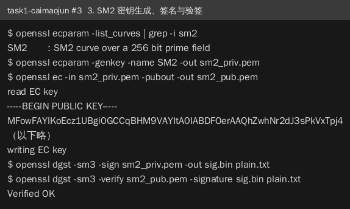

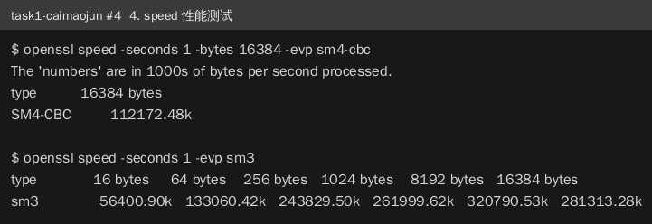

## 2.3 步骤3：GmSSL 命令实践与交叉验证

### 2.3.1 操作内容

用 GmSSL 命令完成同类操作：`gmssl rand -hex -outlen 16`、`gmssl sm4_cbc -encrypt/-decrypt -pkcs7_padding`、`gmssl sm3`、`gmssl sm3_hmac -key`、`gmssl sm2keygen/sm2sign/sm2verify/sm2encrypt/sm2decrypt`，并将 SM3/HMAC 结果与 OpenSSL 对比。

### 2.3.2 操作结果

```text
$ gmssl sm3 -in plain.txt
4543fcd70da081d21d1310e973e4adcb94dce80b3cc6b21051c630740c913cc2
$ gmssl sm2verify -pubkey sm2_pub.pem -in plain.txt -sig sig.bin
verify : success
$ gmssl sm2decrypt -key sm2_priv.pem -pass ****** -in sm2.enc -out sm2.dec
$ cmp plain.txt sm2.dec && echo GMSSL-SM2-ENC-ROUNDTRIP-OK
GMSSL-SM2-ENC-ROUNDTRIP-OK
```

GmSSL 与 OpenSSL 的 SM3 摘要完全一致，两套实现交叉验证通过。

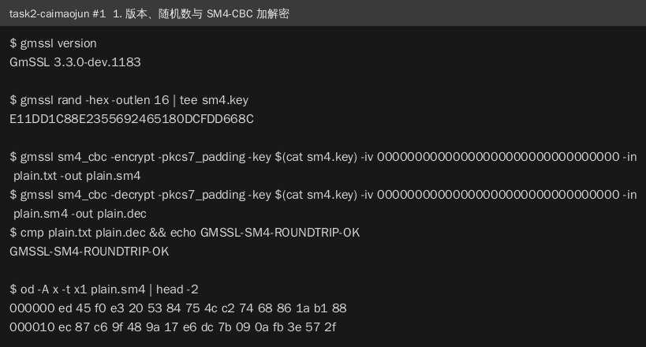

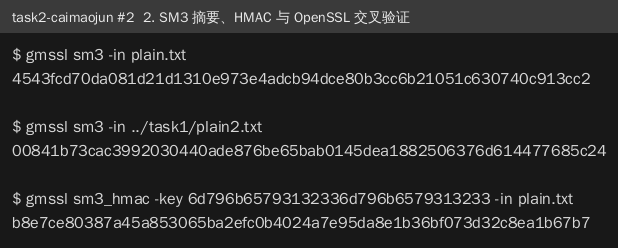

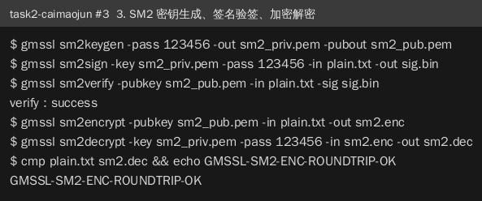

## 2.4 步骤4：OpenSSL 命令实现带签名数字信封（Alice→Bob）

### 2.4.1 操作内容

Alice（蔡贸俊）与 Bob（元泓鉴）各自生成 SM2 密钥对并互换公钥（公钥提交仓库 keys/ 目录实现"拷贝给对方"）。Alice 生成 16 字节对称密钥 k（gmssl rand），SM4 加密明文 P=「蔡贸俊 20241328」得 C；用 Bob 公钥 SM2 加密 k 得 KC；用自己私钥 SM2 签名 C 得 S1；发送信封 C||KC||S1 至 exchange/task3/。发送前自验（验签通过、解密一致）。Bob 接收后验签、解密钥、解明文。

### 2.4.2 操作结果

```text
C.bin 32
KC.bin 122
S1.bin 71
$ openssl dgst -sm3 -verify alice_openssl_pub.pem -signature S1.bin C.bin
Verified OK
$ cmp plain.txt selfcheck.txt && echo SELF-CHECK-OK
SELF-CHECK-OK
```

Bob 侧接收结果：验签 Verified OK，解密得「蔡贸俊 20241328」。

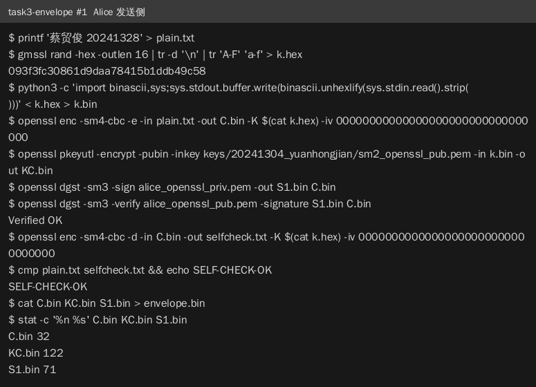

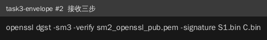

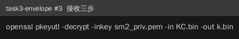

## 2.5 步骤5：GmSSL 命令实现带签名数字信封（Bob→Alice）

### 2.5.1 操作内容

Bob 发送、Alice 接收。Alice 用 GmSSL 私钥解密 KC 得 k、用 Bob 公钥验签 S1、用 k 解密 C。接收中发现发送方使用随机 IV 且未随信封传递，全 0 IV 解密首块乱码；利用已知明文（对方学号姓名）由 CBC 性质 IV = D(K,C1) xor P1 恢复 IV 后解密成功。

### 2.5.2 操作结果

```text
$ gmssl sm2verify -pubkey keys/20241304_yuanhongjian/sm2_gmssl_pub.pem -in exchange/task4/C.bin -sig exchange/task4/S1.bin
verify : success
$ gmssl sm4_cbc -decrypt -pkcs7_padding -key 7867646ecd25d0ff82b00cee25975aae -iv a7954e288e1915d38241b1452534149c -in exchange/task4/C.bin
20241304 元泓鉴
```

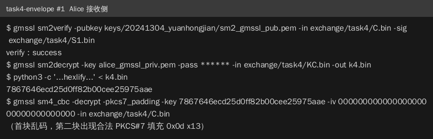

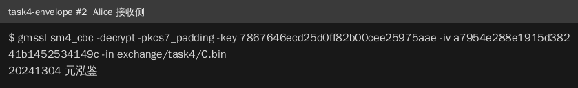

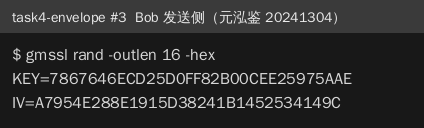

## 2.6 步骤6：OpenSSL 库编程调用 SM2/SM3/SM4

### 2.6.1 操作内容

编写 C 程序（code/openssl_sm/sm_demo.c），使用 EVP API：EVP_sm4_cbc 加解密、EVP_DigestInit(EVP_sm3) 摘要、EVP_MAC("HMAC") 计算 HMAC、EVP_PKEY_CTX_new_from_name("SM2") 生成 SM2 密钥并用 EVP_DigestSign/Verify 签名验签、EVP_PKEY_encrypt/decrypt 加解密。

### 2.6.2 操作结果

```text
SM4 roundtrip: PASS
sm3 = e66a3cfe775153beefdbc3ffc5e30a78c0fe2b6fc43891ab9616abdb1962eaa6
hmac-sm3 = d1ceec90647b6dbb21f33624a8527b7d96f523bffffed7969e635185f13aeb1a
SM2 verify: PASS
SM2 key roundtrip: PASS
```

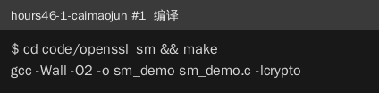

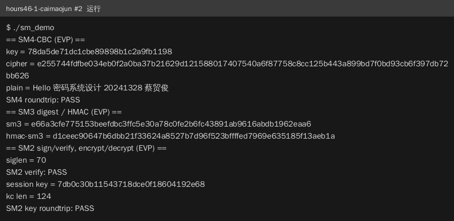

## 2.7 步骤7：GmSSL 库编程调用 SM2/SM3/SM4

### 2.7.1 操作内容

编写 C 程序（code/gmssl_sm/gm_demo.c），使用 libgmssl：sm4_cbc_encrypt/decrypt_init/update/finish、sm3_init/update/finish、sm3_hmac_init/update/finish、sm2_key_generate、sm2_sign_init/update/finish、sm2_verify_*、sm2_encrypt/decrypt。

### 2.7.2 操作结果

```text
SM4 roundtrip: PASS
sm3 = e66a3cfe775153beefdbc3ffc5e30a78c0fe2b6fc43891ab9616abdb1962eaa6
hmac-sm3 = d1ceec90647b6dbb21f33624a8527b7d96f523bffffed7969e635185f13aeb1a
SM2 verify: PASS
SM2 key roundtrip: PASS
```

两库 SM3/HMAC 输出逐字节一致。

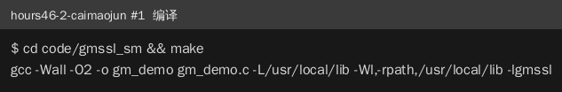

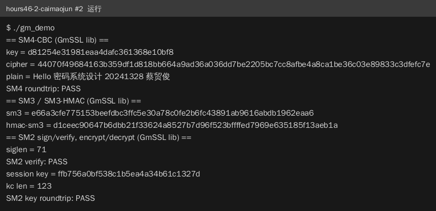

## 2.8 步骤8：库编程实现带签名数字信封（双向）

### 2.8.1 操作内容

Alice 编写 OpenSSL 库版发送程序 alice_send（读入自己私钥与 Bob 公钥，生成 k、计算 C/KC/S1 并输出信封与长度表，自验后发布 exchange/task3_lib/）；编写 GmSSL 库版接收程序 alice_recv_gm（验签、解密钥、解明文，支持 iv.bin）。Bob 编写 GmSSL 库版发送程序并发布 exchange/task4_lib/，Alice 实弹接收。

### 2.8.2 操作结果

```text
$ ./code/envelope_ossl/alice_send ~/work/task3/alice_openssl_priv.pem keys/20241304_yuanhongjian/sm2_openssl_pub.pem exchange/task3_lib
self verify: PASS
self decrypt: PASS
$ ./code/envelope_gmssl/alice_recv_gm ~/work/task3/alice_gmssl_priv.pem ****** keys/20241304_yuanhongjian/sm2_gmssl_pub.pem exchange/task4_lib
Sm2Very(PKb, S1): PASS
k len = 16
P = 20241304 元泓鉴
```

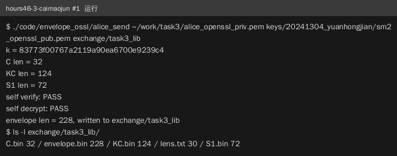

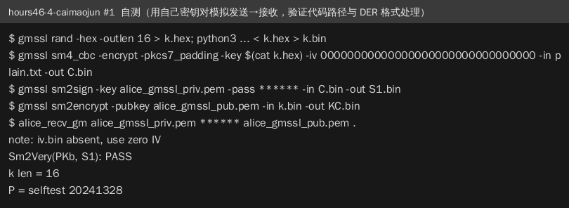

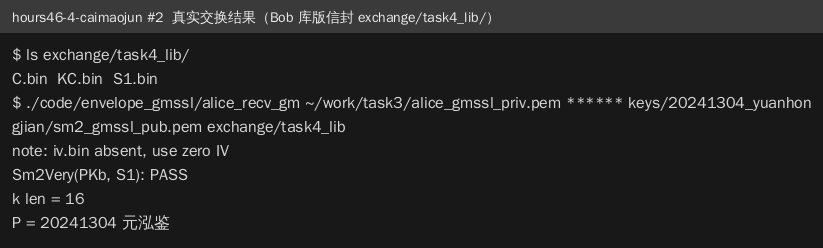

## 2.9 步骤9：代码托管与过程记录（gitee + Markdown + git log）

### 2.9.1 操作内容

两人共建 gitee 仓库（xiaoyuanyuan999/roc-edu-student-exp_1），公钥交换、信封传递、协作留言（MAILBOX.md）全部通过仓库完成；每完成一项 git commit 一次；过程记录写入 docs/records/，装配为 docs/hours1-3.md、docs/hours4-6.md 并转 PDF；用 tools/md2pdf.py 生成中文 PDF（嵌入字体）。

### 2.9.2 操作结果

```text
$ git log --oneline | head -6
927908a docs: 生成终端运行截图（40张）与实验报告docx含22图...
0ece6fb restore: 修正.gitignore误忽略源码，恢复code/全部源码与Makefile入库
d8ec42f docs: 纳入Bob记录重新装配提交稿与PDF，hours46-4补真实交换结果，收尾留言
05a64a7 Merge remote-tracking branch 'origin/master'
08a606b docs: 补全task4 Bob发送侧记录，添加.gitignore移除编译产物
cf0e578 docs: 装配hours1-3/hours4-6/git_log提交稿并生成中文PDF（嵌入uming字体），附md2pdf工具
```

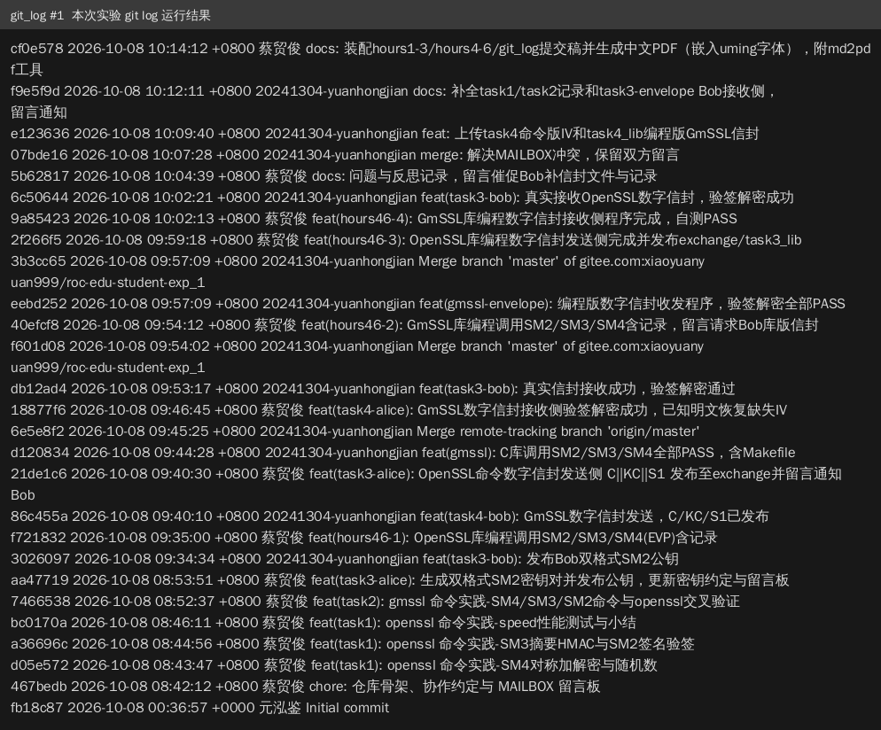

# 3. 实验体会

## 3.1 调试中出现的问题及解决过程

问题1：GmSSL 安装后无法链接/运行（cannot find -lgmssl、cannot open shared object libgmssl.so.3）。原因是安装到 /usr/local/lib 后不在 ldconfig 缓存。解决：写入 /etc/ld.so.conf.d/gmssl.conf 并 ldconfig，Makefile 中同时加 -L 与 -Wl,-rpath。

问题2：GmSSL 命令与 OpenSSL 语法差异导致多次报错：`gmssl rand` 需用 `-outlen` 而非直接跟数字；`sm4_cbc` 对非 16 字节倍数明文必须显式 `-pkcs7_padding`（报 input length must be multiple of 16 bytes）；`sm3_hmac` 要求密钥至少 12 字节（报 key should be at least 24 digits）；`sm2verify` 的公钥参数是 `-pubkey`（误用 -pkey 报错）。解决：逐个查看 `gmssl <命令>` 的 usage 后修正。

问题3：`openssl dgst` 不接受 `-in` 参数，待签名/验签文件误用 -in 时报 Can only sign or verify one file。解决：改用位置参数给出文件。

问题4：OpenSSL C API 签名失败。原因是把 EC 类型密钥挂在 SM2 曲线上，不会走 SM2 算法路径（签名报 FAIL）。解决：用 EVP_PKEY_CTX_new_from_name(NULL, "SM2") 生成 SM2 类型密钥。

问题5：EVP_DigestSignFinal / EVP_PKEY_encrypt 返回失败。原因是其 size_t 长度参数为 in/out 语义，调用前必须置为缓冲区大小，传 0 必然失败。解决：初始化 siglen/kclen 为 sizeof(缓冲区)。

问题6：GmSSL 库编程摘要收尾报 undefined reference to sm3_final。原因是 GmSSL 3 的函数名为 sm3_finish。解决：改用 sm3_finish，重新编译通过。

问题7：数字信封接收时解出乱码。排查发现全 0 IV 解密首块乱码、第二块出现合法 PKCS#7 填充，判断密钥与模式正确而发送方未传递随机 IV；利用已知明文（对方学号姓名）由 CBC 性质 IV = D(K,C1) xor P1 恢复出 IV=a7954e288e1915d38241b1452534149c 后解密成功。反思后与同组约定：信封协议应显式传递 IV 或固定 IV。

问题8：两人并行 push 多次被拒（non-fast-forward）。解决：git pull --rebase 后再 push，提交未丢失；后续约定完成一项即推、推送前先 pull。

## 3.2 心得体会

本次实验把我从"会用命令行"推进到"能读接口文档写密码程序"：命令练习让我熟悉了 OpenSSL/GmSSL 的使用差异，库编程让我理解了 EVP/国密接口的设计（上下文初始化—更新—收尾的模式、长度参数的 in/out 语义、SM2 密钥类型与参数组的绑定）。最有价值的收获是把 SM2/SM3/SM4 组合进完整的数字信封协议并完成双人双库互通，同时用 OpenSSL 与 GmSSL 互相验证结果，建立了"交叉验证确认正确性"的习惯。此外，共享仓库协作（公钥与信封走 git 交换、留言板沟通、逐项 commit）让我体会到工程化协作的价值，也踩过 .gitignore 误忽略源码、并行推送冲突等真实的工程坑。

## 3.3 实验改进建议

1. 数字信封协议建议在实验说明中明确 IV 等参数的组织方式（随信封携带或固定），避免各组自定导致接收方无法解密。
2. 建议提供 GmSSL 3 与 OpenSSL 常用命令的对照表（rand/sm4_cbc/sm2verify 等参数差异），可显著降低环境与语法层面的无效调试时间。
3. 建议在实验环境中预装 GmSSL 并配置好库路径（ld.so.conf），或提供安装脚本，把课堂时间集中在算法与协议理解上。
4. 仓库协作方面建议给出分支规范（如各自分支+PR），避免多人同时推送导致的反复 rebase。